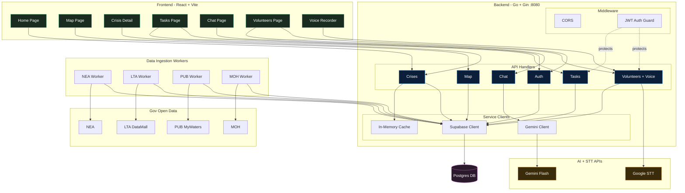

```mermaid
flowchart TB

subgraph FE[Frontend - React + Vite]
  direction LR
  FE_Home[Home Page]
  FE_Map[Map Page]
  FE_Detail[Crisis Detail]
  FE_Tasks[Tasks Page]
  FE_Chat[Chat Page]
  FE_Vol[Volunteers Page]
  FE_Voice[Voice Recorder]
end

subgraph BE[Backend - Go + Gin :8080]
  subgraph MW[Middleware]
    direction LR
    BE_CORS[CORS]
    BE_AuthMW[JWT Auth Guard]
  end
  subgraph HANDLERS[API Handlers]
    direction LR
    BE_AuthH[Auth]
    BE_CrisesH[Crises]
    BE_TasksH[Tasks]
    BE_MapH[Map]
    BE_ChatH[Chat]
    BE_VolH[Volunteers + Voice]
  end
  subgraph CLIENTS[Service Clients]
    direction LR
    BE_Cache[In-Memory Cache]
    BE_Supa[Supabase Client]
    BE_Gem[Gemini Client]
  end
end

SUPA_DB[(Postgres DB)]

subgraph EXT[AI + STT APIs]
  direction LR
  EXT_Gemini[Gemini Flash]
  EXT_STT[Google STT]
end

subgraph GOVDATA[Gov Open Data]
  direction LR
  EXT_NEA[NEA]
  EXT_LTA[LTA DataMall]
  EXT_PUB[PUB MyWaters]
  EXT_MOH[MOH]
end

subgraph ING[Data Ingestion Workers]
  direction LR
  ING_NEA[NEA Worker]
  ING_LTA[LTA Worker]
  ING_PUB[PUB Worker]
  ING_MOH[MOH Worker]
end

FE_Home & FE_Detail --> BE_CrisesH
FE_Map --> BE_MapH
FE_Tasks --> BE_TasksH
FE_Chat --> BE_ChatH
FE_Voice --> BE_VolH
FE_Vol --> BE_VolH
FE_Tasks & FE_Vol --> BE_AuthH

BE_AuthMW -. protects .-> BE_TasksH & BE_VolH

BE_CrisesH --> BE_Cache
BE_CrisesH & BE_TasksH & BE_MapH & BE_AuthH & BE_VolH --> BE_Supa
BE_ChatH --> BE_Gem

BE_Supa --> SUPA_DB
BE_Gem --> EXT_Gemini
BE_VolH --> EXT_STT

ING_NEA --> EXT_NEA
ING_LTA --> EXT_LTA
ING_PUB --> EXT_PUB
ING_MOH --> EXT_MOH
ING_NEA & ING_LTA & ING_PUB & ING_MOH --> BE_Supa

classDef api fill:#0b1f3a,stroke:#4b9cd3,color:#fff;
classDef fe fill:#1a2b1f,stroke:#66cc99,color:#fff;
classDef db fill:#2b1a2b,stroke:#cc66cc,color:#fff;
classDef ext fill:#3a2b0b,stroke:#f0c36d,color:#fff;

class BE_AuthH,BE_CrisesH,BE_TasksH,BE_MapH,BE_ChatH,BE_VolH api;
class FE_Home,FE_Map,FE_Detail,FE_Tasks,FE_Chat,FE_Vol,FE_Voice fe;
class SUPA_DB db;
class EXT_Gemini,EXT_STT ext;
```
