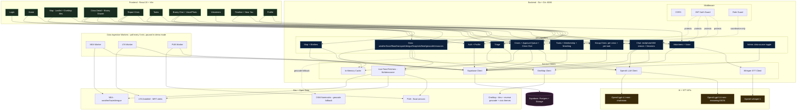

```mermaid
flowchart TB

subgraph FE[Frontend - React 19 + Vite]
  direction LR
  FE_Login[Login]
  FE_Home[Home]
  FE_Map[Map - Leaflet + OneMap tiles]
  FE_Detail[Crisis Detail + Brainy Drawer]
  FE_Report[Report Crisis]
  FE_Tasks[Tasks]
  FE_Chat[Brainy Chat + Voice/Photo]
  FE_Vol[Volunteers]
  FE_Timeline[Timeline + Near You]
  FE_Profile[Profile]
end

subgraph BE[Backend - Go + Gin :8080]
  subgraph MW[Middleware]
    direction LR
    BE_CORS[CORS]
    BE_AuthMW[JWT Auth Guard]
    BE_RoleMW[Role Guard]
  end
  subgraph HANDLERS[API Handlers]
    direction LR
    BE_AuthH[Auth + Profile]
    BE_CrisesH[Crises + Approval Queue + Crisis Chat]
    BE_TasksH[Tasks + Membership + Matching]
    BE_MapH[Map + Shelters]
    BE_DataH[Data: weather/haze/flood/transport/dengue/hospitals/feed/geocode/resources]
    BE_TriageH[Triage]
    BE_ChatH[Chat: text/photo/SSE stream + Sessions]
    BE_VolH[Volunteers + Voice]
    BE_GroupH[Group Chats: per-crisis + per-task]
    BE_AdminH[Admin: data-source toggle]
  end
  subgraph CLIENTS[Service Clients]
    direction LR
    BE_Cache[In-Memory Cache]
    BE_Supa[Supabase Client]
    BE_LLM[OpenAI LLM Client]
    BE_STT[Whisper STT Client]
    BE_OneMap[OneMap Client]
    BE_Feeds[Live Feed Fetchers - lib/datasource]
  end
end

SUPA_DB[(Supabase: Postgres + Storage)]

subgraph EXT[AI + STT APIs]
  direction LR
  EXT_LLM[OpenAI gpt-4.1-mini - chat/vision]
  EXT_LLMJSON[OpenAI gpt-5.4-mini - reasoning/JSON]
  EXT_STT[OpenAI whisper-1]
end

subgraph GOVDATA[Gov + Open Data]
  direction LR
  EXT_NEA[NEA - weather/haze/dengue]
  EXT_LTA[LTA DataMall - MRT alerts]
  EXT_PUB[PUB - flood sensors]
  EXT_ONEMAP[OneMap - tiles + reverse geocode + civic themes]
  EXT_NOM[OSM Nominatim - geocode fallback]
end

subgraph ING[Data Ingestion Workers - poll every 5 min, paused in demo mode]
  direction LR
  ING_NEA[NEA Worker]
  ING_LTA[LTA Worker]
  ING_PUB[PUB Worker]
end

FE_Login --> BE_AuthH
FE_Home & FE_Detail & FE_Report & FE_Timeline --> BE_CrisesH
FE_Map --> BE_MapH
FE_Map & FE_Home --> BE_DataH
FE_Report --> BE_ChatH & BE_DataH
FE_Timeline --> BE_DataH
FE_Detail --> BE_TriageH & BE_TasksH
FE_Tasks --> BE_TasksH
FE_Chat --> BE_ChatH & BE_TriageH & BE_VolH
FE_Detail & FE_Tasks --> BE_GroupH
FE_Vol --> BE_VolH
FE_Profile --> BE_AuthH & BE_VolH

BE_AuthMW -. protects .-> BE_TasksH & BE_VolH & BE_ChatH & BE_GroupH
BE_RoleMW -. coordinator-only .-> BE_CrisesH

BE_CrisesH & BE_DataH & BE_MapH --> BE_Cache
BE_CrisesH & BE_TasksH & BE_MapH & BE_AuthH & BE_VolH & BE_ChatH & BE_GroupH & BE_AdminH --> BE_Supa
BE_ChatH & BE_TriageH & BE_CrisesH --> BE_LLM
BE_VolH --> BE_STT
BE_ChatH & BE_DataH --> BE_OneMap
BE_DataH & BE_TriageH --> BE_Feeds
BE_DataH -. geocode fallback .-> EXT_NOM

BE_Supa --> SUPA_DB
BE_LLM --> EXT_LLM & EXT_LLMJSON
BE_STT --> EXT_STT
BE_OneMap --> EXT_ONEMAP
BE_Feeds --> EXT_NEA & EXT_LTA & EXT_PUB

ING_NEA --> EXT_NEA
ING_LTA --> EXT_LTA
ING_PUB --> EXT_PUB
ING_NEA & ING_LTA & ING_PUB --> BE_Supa

classDef api fill:#0b1f3a,stroke:#4b9cd3,color:#fff;
classDef fe fill:#1a2b1f,stroke:#66cc99,color:#fff;
classDef db fill:#2b1a2b,stroke:#cc66cc,color:#fff;
classDef ext fill:#3a2b0b,stroke:#f0c36d,color:#fff;

class BE_AuthH,BE_CrisesH,BE_TasksH,BE_MapH,BE_DataH,BE_TriageH,BE_ChatH,BE_VolH,BE_GroupH,BE_AdminH api;
class FE_Login,FE_Home,FE_Map,FE_Detail,FE_Report,FE_Tasks,FE_Chat,FE_Vol,FE_Timeline,FE_Profile fe;
class SUPA_DB db;
class EXT_LLM,EXT_LLMJSON,EXT_STT ext;
```
